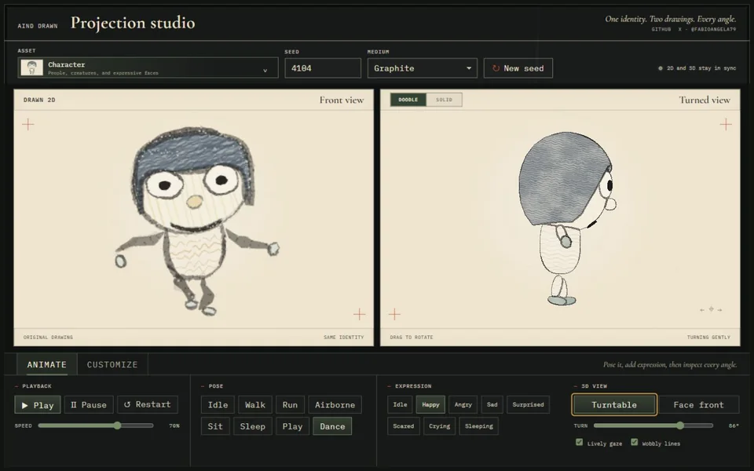
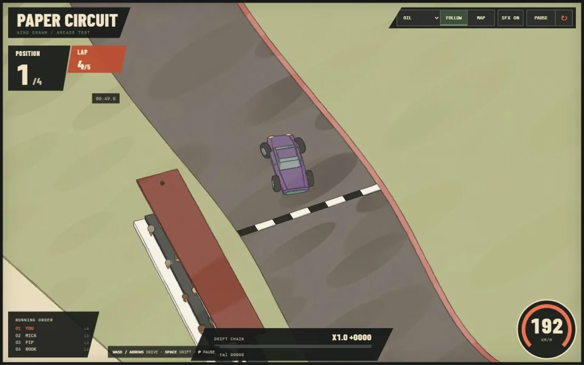
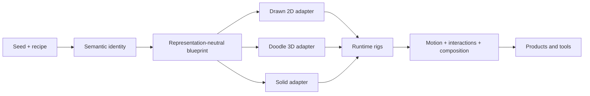

# AIND Drawn

**Deterministic procedural assets that keep their identity while changing drawing medium,
projection, pose, interaction state, and point of view.**

[Visit AIND Drawn](https://mithrilman.github.io/aind-drawn/) ·
[Play Paper Circuit](https://mithrilman.github.io/aind-drawn/doodle-racing/) ·
[Open Projection Studio](https://mithrilman.github.io/aind-drawn/projection-studio/) ·
[Read the architecture](docs/architecture.md) ·
[Author an asset family](docs/asset-authoring.md) ·
[Integrate raster rendering](docs/raster-rendering.md) ·
[Use the game runtime](docs/game-runtime.md)

AIND Drawn is an experimental TypeScript and Three.js library for building procedural subjects
as durable semantic identities rather than disposable images. One resolved character, building,
or vehicle can be rendered as a layered 2D drawing, an inked Doodle 3D object, or a physically
shaded solid without rerolling the traits that make it recognisable.

The same semantic parts then support animation, expressions, articulated interactions, sockets,
colliders, editing, inspection, and game logic. The renderer does not need to know what a wheel or
an eyelid means; each asset family owns its vocabulary and publishes the capabilities that generic
tools may consume.

> **AIND Drawn** plays on *hand-drawn*: it preserves the intent and irregularity of drawing by hand
> while introducing AI-assisted authoring and tooling into the process.

## See it working

| Projection Studio | Paper Circuit |
| --- | --- |
| [](https://mithrilman.github.io/aind-drawn/projection-studio/) | [](https://mithrilman.github.io/aind-drawn/doodle-racing/) |
| Inspect one procedural identity across raster, Doodle 3D, and solid projections. Change medium, art direction, pose, expression, physical treatment, interaction state, and camera without changing the subject. | Race four procedural vehicles through a populated Doodle 3D world, drift, switch drawing media, explore on foot, and operate semantic vehicle parts. |

Both experiments consume the public library barrel. Their previews are generated by the real
runtime; there is no second set of illustrative stand-ins waiting to drift away from the product.

## What exists today

### Durable procedural identity

- Immutable, seeded identities with namespaced deterministic random streams.
- Serialisable recipes that reproduce the same semantic subject.
- Family-owned archetypes, proportions, palettes, parts, topology, sockets, colliders, and
  interaction intent.
- A shared semantic manifest projected into representation-specific blueprints.

### Multiple projections

- Layered raster drawings driven by procedural canvas surfaces and a hand-drawn mark vocabulary.
- Camera-dependent Doodle 3D with semantic surfaces, strokes, view marks, and paper-aware
  compositing.
- Smooth Three.js solids with orthogonal physical substrates and finishes.
- Identity-preserving switches between Graphite, Ink, Watercolour, Oil, Charcoal, and Marker.
- Identity-preserving `authored`, `storybook`, and `cut-paper` direction across every projection.

### Assets that participate

- Characters with poses, playback, expressions, blinking, gaze, and lively line motion.
- Vehicles with steering, wheel rotation, suspension, driving motion, doors, hood, cargo access,
  colliders, and interaction states.
- Buildings with semantic structure and projection-specific rendering.
- Runtime rigs that expose semantic parts instead of forcing consumers to address pixels or opaque
  mesh indices.

### Reusable game foundations

- A renderer-neutral sibling package for typed controls, standard gamepad mapping, fixed-step
  simulation, arcade vehicle motion, and swept structural collision.
- A separate browser adapter for keyboard, pointer, touch, and gamepad events.
- Product-owned adapters from asset dimensions and capabilities to generic gameplay contracts;
  simulation never imports drawing rigs or Three.js.

### Extensible authoring

- Family-specific authoring schemas and capability registration.
- Generic tools that discover controls without hard-coding every asset type.
- Explicit boundaries between identity, blueprint, projection, runtime, and application concerns.
- Tests for determinism, projection parity, topology, lifecycle, exports, and authoring invariants.

## The architecture



The central rule is simple: generate meaning once, then choose how that meaning appears and acts.

| Boundary | Responsibility | Consequence |
| --- | --- | --- |
| Identity | Resolve stable semantic choices from deterministic namespaces | A seed remains recognisable across every projection |
| Blueprint | Preserve parts, topology, pivots, sockets, colliders, and semantic surfaces | Representations share spatial truth without sharing renderer internals |
| Appearance | Bind semantic parts to generic art roles and one immutable direction recipe | Style changes without rerolling identity or hiding family branches in renderers |
| Projection | Translate the blueprint into raster, inked-solid, or smooth-solid data | New renderers do not reroll or redefine the asset |
| Runtime | Own rendering, animation, lifecycle, and disposal | Applications manipulate semantic rigs rather than raw implementation details |
| Capability | Publish family-specific behavior through namespaced contracts | The generic core avoids an expanding catalogue of asset-type branches |

See [the architecture](docs/architecture.md),
[art direction and semantic surfaces](docs/art-direction-and-surfaces.md),
[Doodle 3D stroke rendering](docs/3d-stroke-rendering.md), and the active
[library evolution roadmap](docs/library-evolution-roadmap.md) for the detailed contracts. Raster
cache ownership, custom hands, performance constraints, and renderer-adapter guidance live in
[raster rendering and portability](docs/raster-rendering.md).

## Projection Studio

[Projection Studio](https://mithrilman.github.io/aind-drawn/projection-studio/) is the inspection
and authoring workbench for the library. It currently supports characters, buildings, and vehicles
and exposes:

- synchronised Drawn 2D, Doodle 3D, and physically shaded solid views;
- seeded customisation, drawing-medium selection, art direction, substrate, and finish controls;
- a deterministic all-medium contact sheet with worker-backed structural boil-frame auditing;
- character playback, pose, expression, gaze, and line-motion controls;
- vehicle articulation and semantic interaction controls;
- physical treatment, camera rotation, and turntable inspection;
- controls generated from the same public metadata used by other consumers.

## Paper Circuit

[Paper Circuit](https://mithrilman.github.io/aind-drawn/doodle-racing/) is the proof that these
contracts survive contact with a product rather than only an architecture diagram. It combines:

- four procedural racers built through the public vehicle pipeline;
- a populated Doodle 3D circuit with multiple drawing media;
- arcade driving, steering, suspension, drifting, race effects, telemetry, and audio;
- Follow and full-course cameras;
- an on-foot exploration mode with animated characters;
- interactive vehicle parts driven by semantic pivots and states.

## Authoring a new asset family

The repository includes a detailed Codex skill at
[`.codex/skills/aind-asset-authoring`](.codex/skills/aind-asset-authoring) and a standalone
[asset-authoring guide](docs/asset-authoring.md). Together they cover:

- deciding when an asset deserves its own semantic family;
- deterministic identity, recipes, layout, and blueprints;
- raster, smooth-solid, and Doodle 3D projections;
- parts, topology, pivots, sockets, colliders, and interactions;
- animation and transient effects;
- provider and capability registration;
- Projection Studio integration;
- invariants, tests, and browser verification.

## Getting started

Requirements: a modern Node.js runtime and [pnpm](https://pnpm.io/). The exact pnpm version is
pinned in `package.json`.

```bash
pnpm install
pnpm verify
pnpm dev:landing
```

Other useful commands:

```bash
pnpm dev:projection-studio
pnpm dev:doodle-racing
pnpm build:pages
```

## Minimal example

```ts
import {
  SolidRig,
  SpriteRig,
  applyRasterCharacterMotion,
  applySolidCharacterMotion,
  createCharacterMotionState,
  createCharacterIdentity,
  createRasterCharacterBlueprint,
  createSolidCharacterBlueprint,
  sampleCharacterMotion,
  setCharacterMotion,
} from '@mithrilman/aind-drawn';

const identity = createCharacterIdentity(4107, { species: 'human' });

const drawing = new SpriteRig(createRasterCharacterBlueprint(identity, {
  medium: 'graphite',
  artDirection: 'storybook',
}));
const solid = new SolidRig(createSolidCharacterBlueprint(identity, {
  artDirection: 'storybook',
  physical: { substrate: 'ceramic', finish: 'satin' },
}));

let motion = createCharacterMotionState();
motion = setCharacterMotion(motion, { pose: 'run', speed: 0.9, expression: 'happy' }, 0);
const sample = sampleCharacterMotion(identity, motion, elapsedSeconds);
applyRasterCharacterMotion(drawing, sample);
applySolidCharacterMotion(solid, sample);

scene.add(drawing.root, solid.root);

// The scene owner releases the GPU resources.
drawing.dispose();
solid.dispose();
```

## Repository map

- `src/core` — deterministic randomness, 2D/3D geometry, surfaces, and mark vocabulary.
- `src/appearance` — immutable art-direction recipes and semantic role resolution.
- `src/materials` — drawing intent, drawing media, semantic substance, substrate, and finish.
- `src/assets` — identities, family blueprints, projections, authoring schemas, and capabilities.
- `src/runtime` — sprite, solid, inked-solid, cache, worker, animation, and scene runtimes.
- `experiments/landing` — the public project landing and live projection comparator.
- `experiments/projection-studio` — the asset inspection and authoring workbench.
- `experiments/doodle-racing` — the Paper Circuit game and exploration experiment.
- `docs` — architecture, rendering, roadmap, reference study, and asset-authoring notes.
- `.codex/skills` — repository-local guidance for extending the system safely.

## Status

AIND Drawn is greenfield and intentionally evolving. APIs and rendering policies may change when a
better model appears; backward compatibility is not yet a design goal. The repository is already a
working library with two substantial public consumers, not a frozen framework or a finished product.

## Research provenance

The project began by studying [KinderGrimm](https://github.com/albertobeiz/kindergrimm) by
[Alberto Beiz](https://github.com/albertobeiz), whose procedural characters and hand-drawn media
provided the original creative spark. AIND Drawn is an independent architecture and implementation:
KinderGrimm is preserved as pinned, read-only research material and is not a runtime dependency.
The provenance and reconstruction notes live in
[`references/README.md`](references/README.md),
[`references/kindergrimm.reference.json`](references/kindergrimm.reference.json), and
[`docs/kindergrimm-study.md`](docs/kindergrimm-study.md).

## Contact and license

[Fabio Angela on X](https://x.com/FabioAngela79) · [MIT License](LICENSE)
